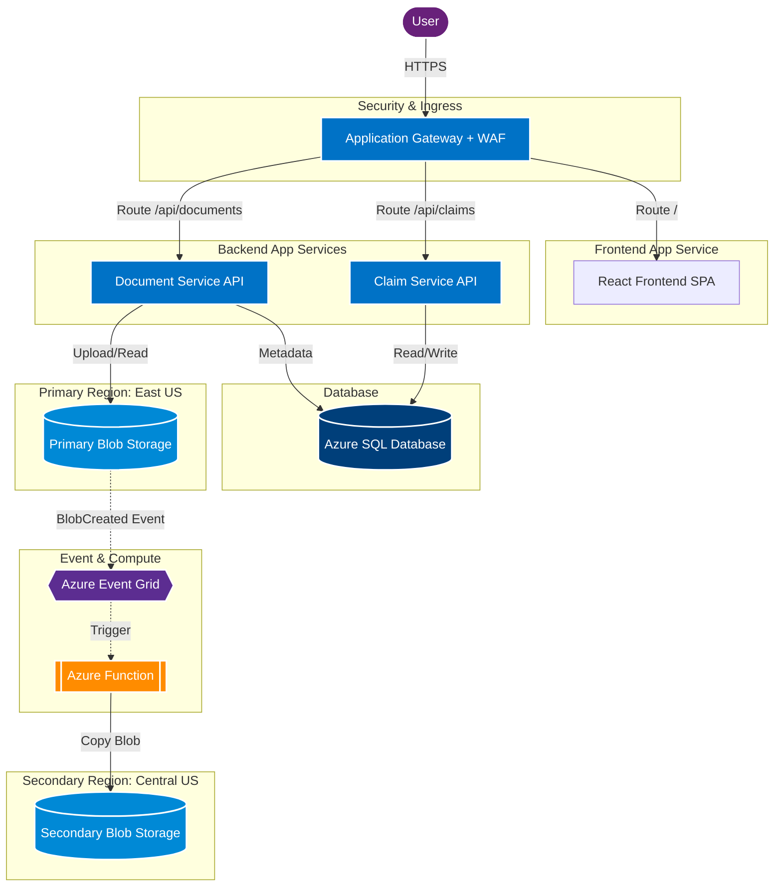

# High-Level Architecture

```text
User (Browser)
       |
[ HTTPS Ingress ]
Application Gateway + WAF
       |
       +-----------------+
       |                 |
 [ Frontend ]      [ Backend ]
App Service       App Service(s)
 (React)               |
                       +-------------------+
                       |                   |
               Claim Service        Document Service
                       |                   |
                       |                   |
                  [ Database ]        [ Primary Storage ]
                   Azure SQL             Blob Storage (East US)
                                           |
                                      [ Event Router ]
                                         Event Grid
                                           |
                                      [ Compute ]
                                      Azure Function
                                           |
                                      [ Secondary Storage ]
                                         Blob Storage (Central US)
```

## Mermaid Diagram


