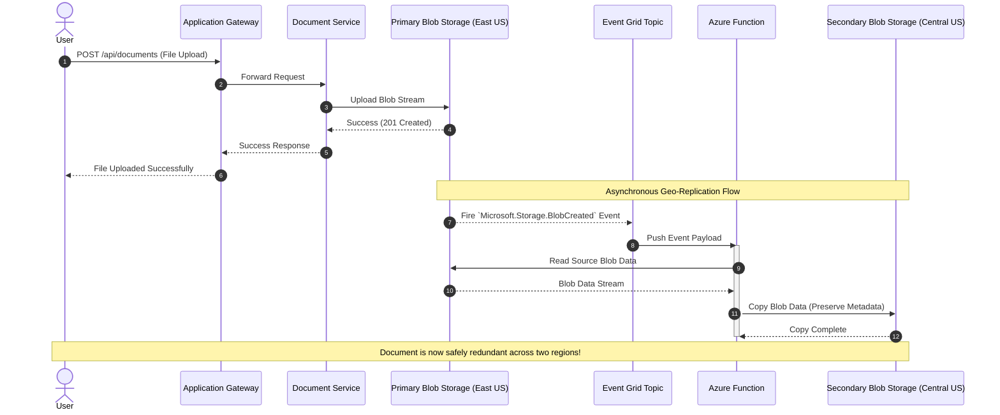

# Document Upload & Replication Sequence

This sequence diagram illustrates how a user uploads a document, how it's stored in the primary region, and the event-driven replication to the secondary region.

## Mermaid Sequence Diagram

